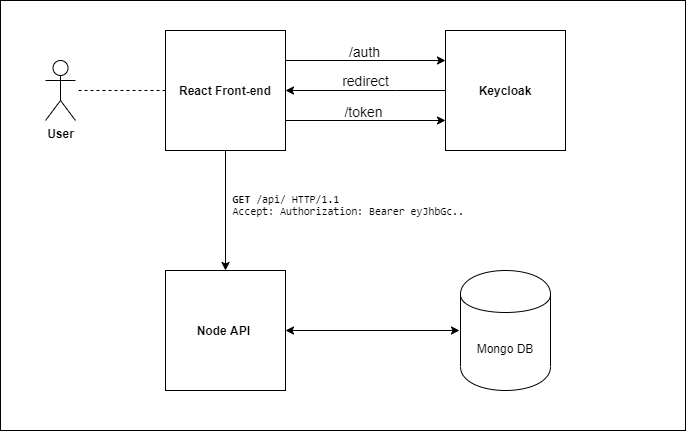

# To-Do List React Application with Keycloak integration

Simple React demo application that uses Keycloak for user authentication. The idea of the app is to demonstrate the concepts of login, SSO and silent authentication for single page applications. It includes a protected RESTful API based on NodeJS and MongoDB to store the user data. Keycloak exposes OAuth/OpenID-Connect endpoints to retrieve user information and issues access tokens by using the authorization code grant flow PKCE.

## Overview



| To-Do List App  | OAuth Terminology    | Description                                                                    |
|-----------------|----------------------|--------------------------------------------------------------------------------|
| User            | Resource owner       | The entity that grants access to the resources                                 |
| React Front-end | Client               | Application which accesses protected resources on behalf of the resource owner |
| Keycloak        | Authorization server | Authenticates the resource owner and issues access tokens                      |
| Node API        | Resource server      | The server that hosts the protected user data                                  |

## How to run
You need docker-compose version 1.22.0 and React 16.0 or later to build the app.

1. You can build and run Docker containers with sample data for Keycloak, Node API and MongoDB, as followes:
```bash
docker-compose up --build
```

2. Then start the React client and access the app under: http://localhost:3000
```bash
cd client
npm install
npm start
```

Keycloak comes with some predefined user profiles

| User Name | Password |
|-----------|----------|
| John      | password |
| Alice     | password |

The admin console is available under: http://localhost:8080/auth/admin

| User Name | Password |
|-----------|----------|
| admin     | password |
